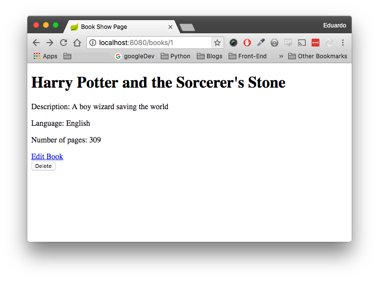

# java_show

## Show
In this assignment, you will continue to build our CRUD web application by implementing the show method. For example, when the user visits '/books/1', you are to respond with a view page that has all the information about a specific book.



And here is the jsp code:

**src/main/webapp/WEB-INF/books/show.jsp**
```java
<%@taglib prefix="c" uri="http://java.sun.com/jsp/jstl/core"%>    
<h1><c:out value="${book.title}"/></h1>
<p>Description: <c:out value="${book.description}"/></p>
<p>Language: <c:out value="${book.language}"/></p>
<p>Number of pages: <c:out value="${book.numberOfPages}"/></p>
<a href="/books/${book.id}/edit">Edit Book</a>
<form action="/books/${book.id}" method="post">
    <input type="hidden" name="_method" value="delete">
    <input type="submit" value="Delete">
</form>
```